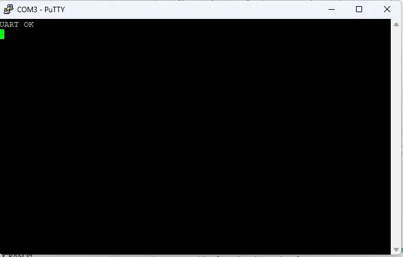

# 📟 STM32 ADC 전압 모니터 (I2C LCD + FreeRTOS)


> STM32 NUCLEO-F446RE로 ADC 전압값을 실시간 측정하여 I2C LCD에 출력하고, FreeRTOS 멀티태스킹으로 UART 디버그 출력을 병렬 처리하는 임베디드 시스템

---

## 📌 프로젝트 개요

| 항목 | 내용 |
|------|------|
| **MCU** | STM32F446RE (NUCLEO-F446RE) |
| **개발 환경** | STM32CubeIDE, HAL 라이브러리 |
| **언어** | C |
| **OS** | FreeRTOS (CMSIS-RTOS v2) |

---

## 🛠️ 기술 스택

| 분류 | 내용 |
|------|------|
| **ADC** | PA0 핀 아날로그 전압 측정 (12bit, 0~4095) |
| **I2C** | LCD 1602 연동 (주소 0x27, PB8/PB9) |
| **UART** | 디버그 출력 (115200 baud) |
| **FreeRTOS** | 멀티태스킹 (LCDTask, UARTTask) |
| **Mutex** | UART 공유 자원 충돌 방지 |

---

## 🔄 시스템 구조

```
[FreeRTOS Scheduler]
        │
        ├── LCDTask (osPriorityNormal)
        │     └── ADC 읽기 → LCD 출력 (1초마다)
        │
        └── UARTTask (osPriorityLow)
              └── Mutex 획득 → UART 출력 → Mutex 해제 (1초마다)
```

---

## ⚙️ 핵심 구현

### 1. FreeRTOS 멀티태스킹
- LCDTask: ADC 값 읽어서 LCD에 실시간 출력
- UARTTask: 1초마다 UART로 디버그 메시지 출력
- 두 Task가 독립적으로 동작하며 FreeRTOS 스케줄러가 관리

### 2. Mutex로 UART 충돌 방지
- 초기 테스트에서 두 Task가 UART를 동시 접근하여 데이터 깨짐 현상 발생
- `osMutexAcquire` / `osMutexRelease` 로 UART 접근 직렬화
- 충돌 없이 안정적인 출력 확인

### 3. ADC + I2C 통합
- 12bit ADC로 전압 측정 후 mV 단위 변환
- I2C LCD에 ADC 값과 전압값 실시간 표시

---

## 🔧 트러블슈팅

### UART 데이터 충돌
- **증상**: 두 Task가 동시에 UART 접근 시 `ADC ADC Task Running` 처럼 데이터 겹침
- **원인**: 공유 자원인 UART에 동기화 없이 접근
- **해결**: FreeRTOS Mutex로 UART 접근 직렬화하여 해결

---

## 📷 동작 사진

### LCD 출력


### 전체 회로 연결


### UART 디버그 출력 (PuTTY)


---

## ⚙️ 핀 연결

| LCD 핀 | NUCLEO 핀 |
|--------|----------|
| VCC | 5V |
| GND | GND |
| SDA | PB9 |
| SCL | PB8 |
| ADC 입력 | PA0 |

---

## ✅ 구현 결과

- [x] ADC 12bit 전압 측정 (0~3300mV)
- [x] I2C LCD 실시간 출력 (1초 갱신)
- [x] FreeRTOS 멀티태스킹 구현 (LCDTask, UARTTask)
- [x] Mutex로 UART 공유 자원 충돌 해결
- [x] UART 디버그 출력 확인

---

## 💡 배운 점

- FreeRTOS Task 생성 및 스케줄러 동작 원리 이해
- Mutex를 활용한 **공유 자원 동기화** 문제 해결 경험
- STM32 HAL로 **ADC, I2C, UART** 통합 제어
- I2C 주소 스캐너로 디바이스 디버깅 경험
